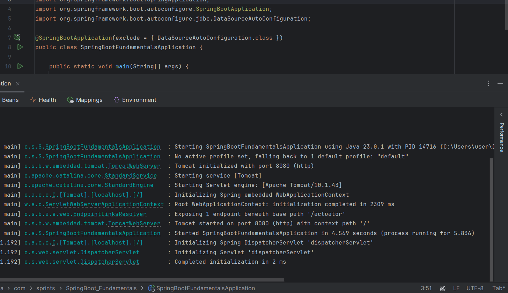
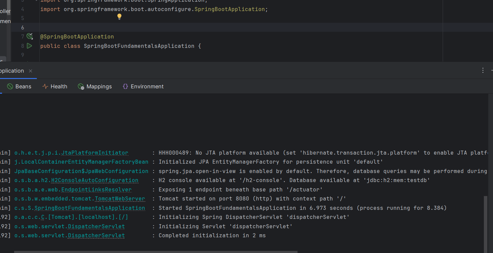

# Spring Annotations Quick Notes

This file summarizes the annotations and configuration used during the Spring Fundamentals tasks, along with placeholders for screenshots where relevant.

---

## 1. DIY IoC/DI (Plain Java)

### Files:

- `di/Printer.java`
- `di/UserService.java`
- `di/Main.java`

### Concepts:

- Manual Dependency Injection using:
  - Constructor injection
  - Setter injection

(No annotations in this step – plain Java approach.)

---

## 2. Introduce Spring Core

### Files:

- `spring-core-demo/Printer.java`
- `spring-core-demo/UserService.java`
- `spring-core-demo/Main.java`

### Annotations:

- `@Component` — Marks a class as a Spring-managed bean.

```java
@Component
public class Printer { }

@Component
public class UserService {
    private final Printer printer;
    public UserService(Printer printer) { this.printer = printer; }
}
```

### Context Initialization:

- Beans were fetched via `AnnotationConfigApplicationContext`.

---

## 3. Spin up Spring Boot

### Project:

- `springboot-fundamentals/`

### Annotations:

- `@RestController` — Marks class as a web controller that returns data.
- `@GetMapping("/hello")` — Maps HTTP GET request to `hello()` method.

### Output:

> Hello, Spring Boot!


---

## 4. Explore `@SpringBootApplication`

### Main Class:

```java
@SpringBootApplication(exclude = { DataSourceAutoConfiguration.class })
public class SpringbootFundamentalsApplication { }
```

### Annotation:

- `@SpringBootApplication` — Combines:

  - `@Configuration`
  - `@EnableAutoConfiguration`
  - `@ComponentScan`

- `exclude = { ... }` prevents specific auto-configurations.



---

---

---

## 5. Profiles & Config Binding

### Config Files:

- `application.properties`

```properties
app.title=Default Title
```

- `application-dev.yml`

```yaml
app:
  title: Dev Title
```

### Java Class:

```java
@Component
@ConfigurationProperties(prefix = "app")
public class AppProperties {
    private String title;
    // getters and setters
}
```

### Controller:

```java
@RestController
public class TitleController {
    @GetMapping("/title")
    public String getTitle() { return appProperties.getTitle(); }
}
```


---

## 6. Qualified DI Example

### Interface:

```java
public interface TimeService {
    String getCurrentTime();
}
```

### Implementations:

```java
@Primary
@Component
public class SystemTimeService implements TimeService { ... }

@Qualifier("mock")
@Component
public class MockTimeService implements TimeService { ... }
```

### Controller:

```java
@RestController
public class TimeController {
    @Autowired
    private TimeService timeService;

    @Autowired
    @Qualifier("mockTimeService")
    private TimeService mockTimeService;
    ...
    ...
}
```


---


